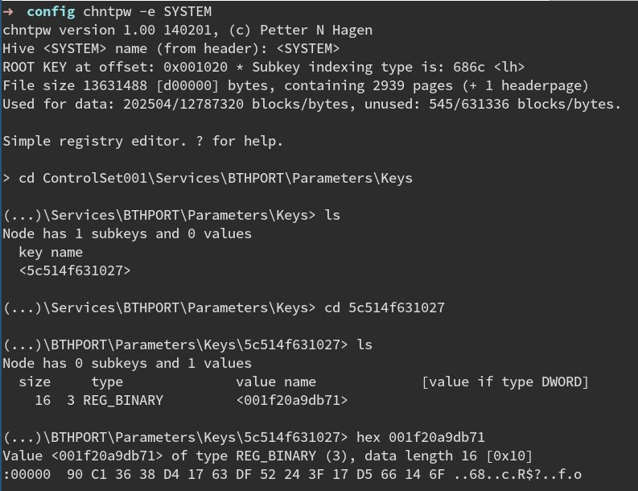
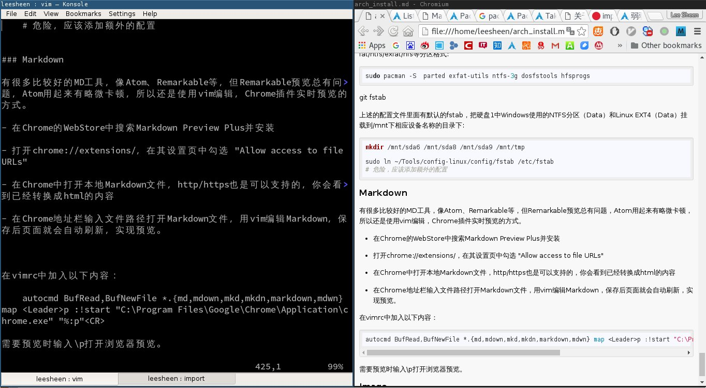

# Arch Linux 安装小记
----------------------

这只是一篇随笔，用来记录从全新安装 Arch Linux 开始，到在使用过程中各种软件配置的过程。

其实对于 Arch Linux 这样滚动更新的 Linux，很少需要重新安装系统。只不过在开始使用 Arch Linux 时遇到的一些问题，有时并没有真正了解其中的原因或者问题被掩盖了，所以通过写一些记录文档，并且把一些花时间配置的文件备份下来，无论以后再次使用还是整理思路都是好的。

**注意:** 这**不是**一个安装 Arch Linux 的完整过程，[ArchWiki] [1] 才是。但对于一些用户可以作为参考。

  [1]: https://wiki.archlinux.org

## 1. 系统安装

### 启动模式

检查启动模式是否支持UEFI，这将决定在安装 Bootloader 阶段的步骤:

    ls /sys/firmware/efi/efivars

### 网络连接

有线用户在 DHCP 可以获取 IP 的情况下，一般可以连接网络，无线用户可以使用下面命令选择网络连接:

    wifi-menu -o wlp3s0 # 使用WiFi

测试网络是否连通:

   	ping -c 3 www.archlinux.org

### 时间

使能 NTP 服务，更新系统时间，确保时间的准确性:

    timedatectl set-ntp true
    timedatectl status

### 磁盘

查看磁盘信息，以选定使用的磁盘:

    lsblk

创建/更改磁盘信息，这里对磁盘 /dev/sdb 重新分区，使用 gpt 格式:

    parted /dev/sdb

    (parted) mklable gpt
    (parted) mkpart ESP fat32 1MiB 513MiB
    (parted) set 1 boot on
    (parted) mkpart primary ext4 513MiB 100%

格式化分区:

    mkfs.fat -F32 /dev/sdb
    mkfs.ext4 /dev/sdx

挂载分区，此处最好添加相应的参数，尤其是btrfs:

    mount /dev/sdb2 /mnt -o defaults,noatime,discard
    mkdir /mnt/boot
    mount /dev/sdb1 /mnt/boot

### 镜像

选择安装使用的镜像服务器，一般使用 China 几个，解注释/移动到文件首:

    vim /etc/pacman.d/mirrorlist

同步镜像服务器并安装:

    pacman -Syy #一般不需要，但可以测试选择镜像服务器速度用

    pacstrap -i /mnt base base-devel

### fstab

以UUID的方式生成fstab:

    genfstab -U /mnt >> /mnt/etc/fstab

检查并修改fstab
	
    vim /mnt/etc/fstab

~~因为使用SSD并支持TRIM，修改参数减少硬盘写入，并添加discard开启TRIM:~~
fstrim.service and fstrim.timer 比上述更常用，某些情况或者分区格式下，
此方法无效，可以使用discard参数。

### chroot

chroot系统，以完成安装的最后工作:

    arch-chroot /mnt /bin/bash

### 安装一些工具

这里预先安装一些常用的工具，更多工具可以等到系统安装完毕再安装:

    pacman -S vim intel-ucode iw wpa_supplicant dialog zsh 
    # intel-ucode是intel的微码工具

### 本地化

编辑下面文件，解注释使用到的类型:

    vim /etc/locale.gen

保存后使之生效:

    locale-gen

创建本地化选项:

    echo LANG=en_US.UTF-8 > /etc/locale.conf

### 时间

设置时区，并同步到系统时钟:

    tzselect
    ln -s /usr/share/zoneinfo/Asia/Shanghai /etc/localtime
    hwclock --systohc --utc

### ramdisk

创建初始的ramdisk:

    mkinitcpio -p linux

### Bootloader

#### EFISTUB

因为使用 UEFI + GPT，直接使用 systemd 工具生成启动信息:

    bootctl install

创建启动配置文件:

    vim /boot/loader/entires/arch.conf

添加下列信息:

    title		Arch Linux
    linux		/vmlinuz-linux
    initrd		/intel-ucode.img #安装intel-ucode后添加
    initrd		/initramfs-linux.img
    options		root=/dev/sdb2 rw #/文件系统的分区
    
修改文件默认启动信息:

    vim /boot/loader/loader.conf
    #add default arch & add timeout 0

#### Grub

在需要使用grub引导的情况下，可以安装grub工具：

	pacman -S grub efibootmgr

配置grub

	grub-install --target=x86_64-efi --efi-directory=/boot --bootloader-id=grub
	grub-install --target=i386-efi --efi-directory=/boot --bootloader-id=grub

//TODO BIOS System LVM RAID etc... 

### 计算机名

设置此系统的名称:

    echo leesheen-X240 > /etc/hostname

并在 /etc/hosts 添加同样的主机名:

    vim /etc/hosts
    # 添加 leesheen-X240 到文件中两行内容的末尾

### root密码

设置root用户密码:

    passwd

### 完成

退出chroot环境:

    exit

卸载磁盘:

    umount /mnt -R

重启:

    reboot

## 2. 系统安装后

系统重启后以root用户登录系统。

### Set Network

//TODO

LAN

WLAN

### 用户

通常我们应该使用普通（非root）用户使用Linux系统，需要root权限时使用sudo。

创建一个leesheen的用户:

    useradd -m -G wheel -s /bin/zsh leesheen
    passwd leesheen

解注释下面，使得wheel组用户可以拥有sudo权限

	%wheel ALL=(ALL) ALL

### AUR

Arch Linux 的用户软件源有庞大的资源，这也是Archer热爱它的一个原因，其中yaourt是一个很好的AUR助手工具，能帮助用户自动化中间的过程。

编辑pacman的配置文件:

    vim /etc/pacman.conf

添加archlinuxcn的源:

    [archlinuxcn]
    SigLevel = Optional TrustAll
    Server = http://mirrors.163.com/archlinux-cn/$arch

Arch Wiki上提供的源有点慢，这里有国内的源的地址，可以测试速度后自行选择:

    Server = http://repo.archlinuxcn.org/$arch
    Server = http://mirrors.ustc.edu.cn/archlinuxcn/$arch
    Server = https://mirrors.ustc.edu.cn/archlinuxcn/$arch
    Server = http://mirrors.cqu.edu.cn/archlinux-cn/$arch
    Server = http://mirrors.163.com/archlinux-cn/$arch
    Server = http://mirrors.hustunique.com/archlinuxcn/$arch
    Server = http://mirrors.4.tuna.tsinghua.edu.cn/archlinuxcn/$arch
    Server = http://mirrors.tuna.tsinghua.edu.cn/archlinuxcn/$arch # both IPv4 & IPv6
    Server = http://mirrors.6.tuna.tsinghua.edu.cn/archlinuxcn/$arch # only IPv6

修改完后更新源并且安装yaourt:    

    pacman -Syu yaourt

### 驱动

用户主机为ThinkPad X240，Intel Haswell HD4400单集显:

安装ThinkPad触摸板驱动:

    pacman -S xf86-input-libinput xf86-input-synaptics

安装显示驱动:

    pacman -S mesa-libgl xf86-video-intel libva-intel-driver libvdpau-va-gl
	mesa-demos

### 声音

内核已经集成ALSA驱动，这里安装工具:

	pacman -S alsa-utils

ThinkPad X240默认识别两个声卡，把HDMI通道的声卡设置成为默认，这里如果想使用笔记
本上的声卡，把PCH设置成默认，添加启动加载文件:
//TODO look pcm

	vim /etc/modprobe.d/alsa-base.conf

添加如下代码设置:

	# Set pcm is default sound card
	options snd_pcm index=0
	options snd_hda_intel index=1

重新启动，PCH声卡就变成默认声卡了。

### 切换用户

以上操作基本上完成了 Arch Linux 核心部分的安装，下面针对不同的用户和不同的需要进行操作，也会以普通用户身份登录了。

重启以普通用户身份登录

    reboot

## 3. 用户软件安装

### GFW

#### Shadowsocks

Shadowsocks是一个轻量级socks5代理，以Python写成。

安装SS:

    sudo pacman -S shadowsocks libsodium python2-numpy python2-salsa20 python2-m2crypto

拷贝默认配置文件:

    sudo cp /etc/shadowsocks/example.json /etc/shadowsocks/config.json
    # 按自己shadowsocks配置修改

后台启动服务并且开机自启:

    sudo systemctl enable shadowsocks@config
    sudo systemctl start shadowsocks@config

#### Proxychains

很多时候应用不支持代理或者某些代理方式，Proxychains是一个将socks5等代理类全局化的工具。安装:

    sudo pacman -S proxychains-ng

修改配置文件/etc/proxychains.conf

    # 修改最后一行
    socks5 127.0.0.1 1080

然后就可以在Terminal中使用它让xxx应用走socks5代理:

    proxychains xxx

### git

git不仅仅是一个版本管理工具，很多时候也是我们获取内容的工具。安装:

    sudo pacman -S git

配置git:

    git config --global user.name "Lee Sheen"
    git config --global user.email "leesheen@outlook.com"

很多时候访问Github很难，而我大部分git都是在Github上完成的，所以让所有的git都使用socks5代理来保证速度。当然也可以不添加，在访问困难的时候配合Proxychains使用，添加代理信息:

    git config --global https.proxy 'socks5://127.0.0.1:1080'
    git config --global http.proxy 'socks5://127.0.0.1:1080'

### 配置文件

为了同步多太电脑配置方便，我把一些配置文件同步到Github，先把配置文件clone下来:

    mkdir ~/Tools
    cd ~/Tools

    git clone https://www.github.com/leesheen/config-linux.git

在~/Tools/config-linux/下就是后面需要的配置文件了。

### Zsh

Zsh是一个功能强大的Shell，我们用其代替系统默认的bash。在前我们已经安装:

    # pacman -S zsh

Zsh的高可定制性使我们获得一个优秀配置变得比较复杂，还好有个开源项目叫Oh-my-zsh，使用官网的脚本直接配置安装:

    sh -c "$(curl -fsSL https://raw.github.com/robbyrussell/oh-my-zsh/master/tools/install.sh)"

    # 或者使用wget

    sh -c "$(wget https://raw.github.com/robbyrussell/oh-my-zsh/master/tools/install.sh -O -)"

    # 没有速度可配合Proxychains使用，或者执行备份脚本的内容:

	./Tools/config-linux/script/ohmyzsh_install.sh

添加alias

	vim .zshrc

	#添加需要的alias到最后
	alias pcs='proxychains -q'

**注意：**如果想在root用户下也使用zsh的此配置，在root用户下执行上面的命令

### Vim

Vim是一个强大的编辑器，对我来说最强大之处在于它的速度，任何大小的文件处理起来没有卡顿。无论是码代码还是Markdown，它的顺滑让我的工作更加专注，此前在安装初期我们已经安装:

    # pacman -S vim

- YCM

YouCompleteMe拥有强大的补全和语义检查功能，安装:

	yaourt vim-youcompleteme-git

YCM检查语义需要clang的支持，安装:

    pacman -S clang

链接全局配置文件到配置目录j

- Ctags

Ctags是Linux下的跟踪文件的利器，安装:

	pacman -S ctags

- Vundle

它的强大之处也在于它的高可定制行，丰富的插件让我们的工作更加简单，但和其他插件丰富的工具（Chrome/Atom）不同的是，它没有一个官方的渠道管理这些插件，所以使用一个插件来管理这些插件，它叫Vundle，使用git安装:

    git clone https://github.com/VundleVim/Vundle.vim.git ~/.vim/bundle/Vundle.vim

把配置好的vimrc链接到家目录的vimrc:

    ln ~/Tools/config-linux/config/vimrc ~/.vimrc

键入命令安装插件:

    vim +PluginInstall +qall 

**注意：**如果使root用户或者sudo下使用vim也插件化，上述步骤在root用户下也操作一遍其中PowerLine插件需要额外的字体，安装:

	yaourt ttf-cosolas-powerline

Ubuntu 下设置

	http://blog.topspeedsnail.com/archives/2652

### Keyboard

Xbindkeys是一个可以允许用户自定义键值的程序，我们可以利用它来自定义一些按键，比
如静音和增减音量的快捷键不能使用等，安装:

	sudo pacman -S xbindkeys

这里使用配置文件中的配置:

	ln ~/Tools/config-linux/config/xbindkeysrc ~/.xbindkeysrc

这个文件使用了以下工具

- Sound: **alsa-utils** 上述已经安装；
- BackLight: **xinit-backlight** 上述已经安装；
- MultiScreen: **lxrandr** 需要安装；
- Wi-Fi: 默认按键可以使用up/down Wi-Fi；
- Setting: TODO
- Search: TODO
- Finder: **xfce4-appfinder** 下述xfce4安装；
- FileManager: **nautilus** 下述xfce4安装；

安装上述需要安装的工具:

	sudo pacman -S lxrandr arandr

~~添加xbindkeys启动到xinitrc~~，下面配置文件中已经包含。

### X/桌面环境/窗口管理器

#### Xorg:

Xorg 是 X11 窗口系统的一个开源实现，当使用桌面环境或者窗口管理器时需要X配合，
安装Xorg和其工具包:

    sudo pacman -S xorg-server xorg-server-utils xorg-apps xorg-xinit

    ln ~/Tools/config-linux/config/xinitrc ~/.xinitrc
    # 其中添加了fcitx和启动i3
	cp /etc/X11/xinitrc/xserverrc ~/.xserverrc

#### 安装Xfce

xfce4是一个轻量级模块化的桌面环境。一般在需要桌面环境的时候作为备用。

- 安装:

安装xfce4和常用软件包:

    sudo pacman -S xfce4 xfce4-goodies

	yaourt solarized-dark-themes

安装NetworkManager

	pacman -S networkmanager network-manager-applet xfce4-notifyd dnsmasq ppp rp-pppoe modemmanager

	sudo systemctl enable NetworkManager
	sudo systemctl start NetworkManager

安装Bluetooth:

	pacman -S bluez bluez-utils blueman

	sudo systemctl enable bluetooth
	sudo systemctl start bluetooth

如果需要开机启动蓝牙，添加下面文件:

	vim /etc/udev/rules.d/10-local.rules

	# Set bluetooth power up
	ACTION=="add", KERNEL=="hci0", RUN+="/usr/bin/hciconfig hci0 up"

配对蓝牙鼠标:

如果使用双系统，而且使用蓝牙鼠标，那么让两个系统使用不用每次配对:

	sudo pacman -S chntpw

	mount /dev/sda4 /mnt/tmp/				# 挂载Windows安装目录
	cd /mnt/tmp/Windows/System32/config/ 

	chntpw -e SYSTEM 

在chntpw下执行:

	cd ControlSet001\Services\BTHPORT\Parameters\Keys 
	ls										# 查看蓝牙的名称，选择进入
	cd 5c514f631027 

复制上图的16进制代码并删除空格

	90C13638D41763DF52243F17D566146F

	su 										# 切换到root模式
	cd /var/lib/bluetooth/
	ls										# 查看蓝牙名称，应与上述一致
	cd 5c:51:4f:63:10:27 
	ls
	cd 00:1F:20:A9:DB:71

	vim info 

把上述复制的16进制代码替换Key的值，保存重启即生效。

安装VPN:

    yaourt strongswan 
	yaourt networkmanager-strongswan

#### 安装i3窗口管理器:

- 安装i3-wm:

窗口管理器的效率在习惯养成后远远大于桌面环境，awesome/i3-wm等都是代表者，而i3-wm更是简单高效。

    sudo pacman -S i3-wm i3lock i3status

- 安装工具:

//TODO

    yaourt dmenu2 
	yaourt j4-dmenu-desktop-git

- 配置文件

创建i3的配置文件:

    mkdir -p ~/.config/i3 ~/.config/i3status
    ln ~/Tools/config-linux/config/i3/config ~/.config/i3/config
    ln ~/Tools/config-linux/config/i3/i3status ~/.config/i3status/config

背景

	pacman -S feh imagemagick

	feh --bg-scale /path/to/image

- 使用X

安装配置完成就可以进入X了，通常进入i3:

    startx

### 浏览器

个人喜欢Chrome浏览器，在Arch下Pacman库中为开源的Chromium，不包含Flash组件，但现在国内的很多网站下缺少不了Flash，我选择同时安装，在移动状态下使用电池时选择Chromium。安装Chrome/Chromium:

    sudo pacman -S chromium

    yaourt google-chrome-stable

### 字体

安装常用的英文字体和中文字体，个人很喜欢adebe的source系列开源字体，安装:

    sudo pacman -S ttf-dejavu wqy-microhei
    sudo pacman -S adobe-source-code-pro-fonts \
              adobe-source-sans-pro-fonts \
              adobe-source-serif-pro-fonts \
              adobe-source-han-sans-cn-fonts

	yaourt ttf-monaco

//TODO 配置Terminal默认中文字体

### 输入法

个人喜欢使用fcitx框架，在此框架下提供的中文输入法比较好用，这里只选择安装sogou输入法:

    sudo pacman -S fcitx fcitx-im fcitx-qt5 fcitx-configtool

    yaourt fcitx-sogoupinyin

在X下使用fcitx-configtool添加Sogou Pinyin，重新加载fcitx后，使用shift键就可以切换中/英文了。

### Terminal

以为之前使用KDE Plasma，很喜欢Konsole，但其实xfce4-terminal一样能完成Konsole的工作，而且更轻量。

#### xfce4-terminal

在xfce安装过程中已经安装过xfce4-terminal。

添加配置文件:

	# 创建配置文件目录
	mkdir -p ~/.config/xfce4/terminal
	# 链接配置文件
	ln ~/Tools/config-linux/terminalrc ~/.config/xfce4/terminal/terminalrc

#### ~~Konsole~~

~~安装Konsole，选择VLC为后端:~~

    # sudo pacman -S konsole

### Media

#### MPlayer

MPlayer是一个开源的播放器，快速好用，安装:
	
	sudo pacman -S mplayer
	# 自带解码包依赖

TODO: 配置文件字幕

#### 

### 文件管理器

通常使用xfce4下的thunar，一般情况下也很少用到，安装xfce4已经包含thunar。

- Dropbox
	yaourt thunar-dropbox
	yaourt dropbox-experimental

### 压缩

安装常用的压缩/解压缩的工具:

    sudo pacman -S unzip p7zip lzop cpio unrar

### 磁盘

之前使用Windows，所以硬盘中包含NTFS分区和额外的ext4分区，首先安装必要的磁盘工具支持fat/ntfs/exfat/hfs等分区格式:

    sudo pacman -S parted exfat-utils ntfs-3g dosfstools hfsprogs hdparm 

上述的配置文件里面有默认的fstab，把硬盘1中Windows使用的NTFS分区（Data）和Linux EXT4（Data）挂载到/mnt下相应设备名称的目录下:

    sudo mkdir /mnt/sda6 /mnt/sda8 /mnt/sda9 /mnt/tmp
	sudo chmod g+w *

    sudo ln ~/Tools/config-linux/config/fstab /etc/fstab
    # 危险，应该添加额外的配置

	sudo hdparm -I /dev/sdb | grep TRIM

	systemctl enable fstrim.service fstrim.timer
	systemctl start fstrim.service fstrim.timer

### Markdown

有很多比较好的MD工具，像Atom、Remarkable等，但Remarkable预览总有问题，Atom用起来有略微卡顿，所以还是使用vim编辑，Chrome插件实时预览的方式。

#### Atom

Atom是Github官方的编辑器，原生支持Markdown，安装Atom:

    yaourt atom-editor

Atom和其他出色的编辑工具一样，拥有众多插件，这里安装Markdown相关的MD转PDF和vim模式的插件:

    apm vim-mode ex-mode markdown-pdf
    # Atom的插件在Github上，可以使用proxychains协助安装

#### Vim + Chrome插件

- 在Chrome的WebStore中搜索Markdown Preview Plus并安装

- 打开chrome://extensions/，在其设置页中勾选 "Allow access to file URLs"

- 在Chrome中打开本地Markdown文件，http/https也是可以支持的，你会看到已经转换成html的内容

- 在Chrome地址栏输入文件路径打开Markdown文件，用vim编辑Markdown，保存后页面就会自动刷新，实现预览。

在vimrc中加入以下内容：

    autocmd BufRead,BufNewFile *.{md,mdown,mkd,mkdn,markdown,mdwn} map <Leader>p :!start "C:\Program Files\Google\Chrome\Application\chrome.exe" "%:p"<CR>

需要预览时输入\p打开浏览器预览。

### Image

imagemagick

### 下载

wget

### SSH

	yaourt openssh-hpn-git

### WPS

	yaourt wps-office ttf-wps-fonts

### 索引

	pacman -S mlocate
	updatedb

### KVM

	pacman -S qemu libvirt pm-util virt-manager
	pacman -S ebtables dnsmasq bridge-utils openbsd-netcat

修改配置文件:

	vim /etc/libvirt/libvirtd.conf

	# 解注释下面的配置
	unix_sock_group = "libvirt"
	unix_sock_ro_perms = "0777"  # set to 0770 to deny non-group libvirt users
	unix_sock_rw_perms = "0770"
	auth_unix_ro = "none"
	auth_unix_rw = "none"

	systemctl enable libvirtd.service virtlogd.service
	systemctl start libvirtd.service virtlogd.service

### NFS

	pacman -S nfs-utils

配置文件

	vim /etc/exports
	添加
	/srv/nfs4/ 192.168.1.0/24(rw,fsid=root,no_subtree_check)
	/srv/nfs4/music 192.168.1.0/24(rw,no_subtree_check,nohide) # note the nohide option which is applied to mounted directories on the file system.

	vim /etc/conf.d/nfs-server.conf

	添加
	NFSD_OPTS="-N 2 -N 3"

启动服务

	systemctl enable nfs-server
	systemctl start nfs-server

### Samba

	pacman -S samba
	cp /etc/samba/smb.conf.default /etc/samba/smb.conf

### Gedit

### VirtualBox

	pacman -S virtualbox virtualbox-guest-iso qt4 net-tools
	yaourt virtualbox-ext-oracle

	gpasswd -a leesheen vboxusers

### Temp

	pacman -S hddtemp
